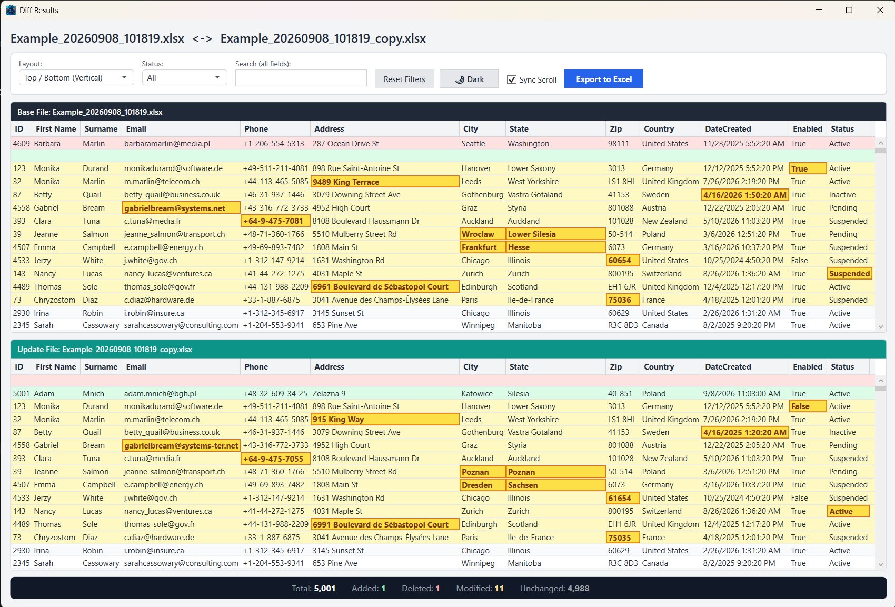
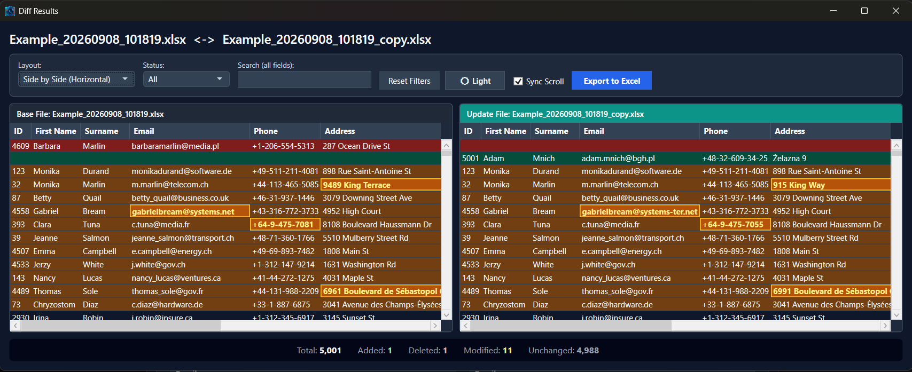
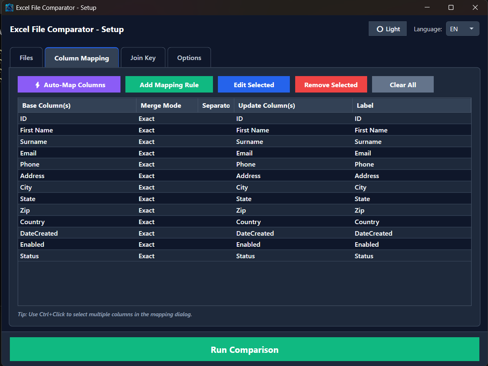
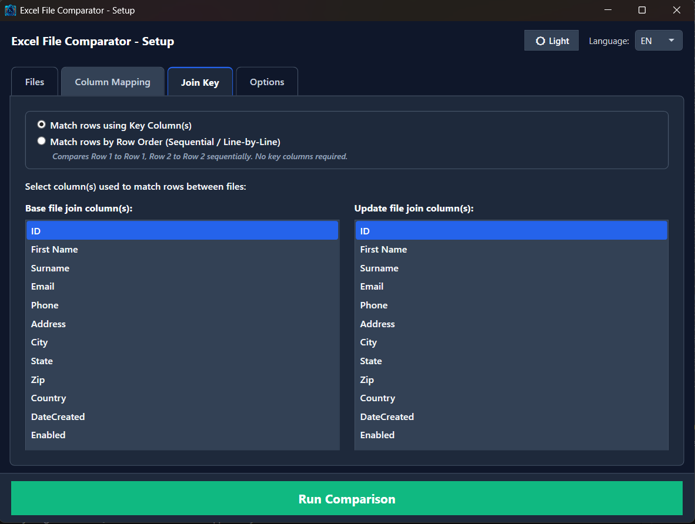
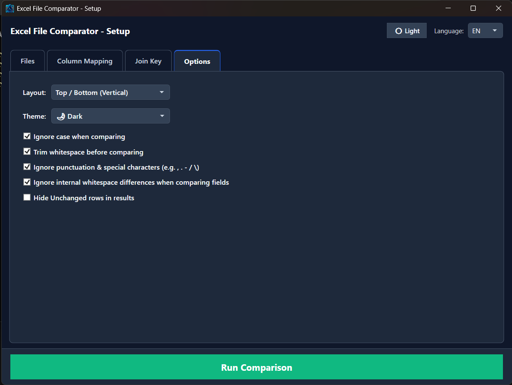

# Compare-ExcelFiles — User Guide / Instrukcja obsługi / Bedienungsanleitung

[English](#english-user-guide) | [Polski](#polska-instrukcja-obsługi) | [Deutsch](#deutsche-bedienungsanleitung)

---

<a name="english-user-guide"></a>
# English User Guide

## ❗ EXE & Standalone Executable
The uploaded EXE file (`Compare-ExcelFiles.exe`) was packaged using [PS2EXE](https://github.com/MScholtes/PS2EXE). If you ever need to inspect or modify the source code, you can extract the original PowerShell script directly from the executable by running:
```powershell
.\Compare-ExcelFiles.exe -extract:Compare-ExcelFiles.ps1
```

## 📌 Overview

**`Compare-ExcelFiles`** is a high-performance PowerShell WPF desktop application engineered for comparing two Excel (`.xlsx`, `.xls`) or delimited text (`.csv`) files. It effortlessly handles mismatched column names, differing layouts, combined/concatenated fields, sequential row-order matching, and large datasets.

Created with GitHub Copilot based on custom automation scripts.



### 🌟 Key Capabilities

- **⚡ High-Performance Fast-Path + Compiled .NET Engine (`FastDiffHelper`)**:
  - In-memory compiled static C# diff engine compatible with Windows PowerShell 5.1 (.NET Framework) and PowerShell Core 7+ (.NET Core).
  - Short-circuit equality fast-path skips cell-by-cell diff generation when rows are identical.
  - Precompiled regular expressions for lightning-fast whitespace and punctuation normalization.
  - Single-pass `[PSCustomObject]` record creation yielding an **80%–84% speed improvement** (5,000 rows diffed in ~1.3 seconds).
  - 100% zero external binary dependencies.

- **🎯 Interactive Row-Click Filtering**:
  - Clicking any row in either the Base File or Update File grid instantly filters and isolates that exact joined pair across both views.
  - A prominent badge button **`✕ Clear Row Filter`** appears in the toolbar to quickly restore the full list.
  - Pressing the **`Esc`** key instantly clears the filter while preserving your scroll position and selection.

- **🔢 Match Rows by Row Order (Sequential / Line-by-Line)**:
  - Compare files 1:1 strictly by row index (Row 1 to Row 1, Row 2 to Row 2...) without requiring unique ID or key columns.
  - Ideal for ledger sheets, bank exports, serial transaction logs, and unindexed datasets.
  - Rows are displayed in their natural original file order.

- **🌙 Dynamic Dark & Light Theme Modes**:
  - Deep slate dark mode (`#0F172A` background, `#1E293B` cards, `#334155` inputs/headers, `#F8FAFC` high-contrast text).
  - Clean, modern light mode designed for high ambient lighting.
  - Native Windows 10/11 DWM dark title bar integration via `DwmSetWindowAttribute`.
  - Real-time theme toggle (`🌙 Dark` / `☀️ Light`) on the header, toolbar, or settings tab.
  - Preferences persist across sessions in `%APPDATA%\Compare_ExcelFiles\settings.xml`.

- **⚡ 1-Click Automatic Column Mapping (Auto-Map)**:
  - Heuristically pairs identical and similar columns between files (case-insensitive & trimmed).
  - Smart Join Key detection: automatically pre-selects primary identifiers (`ID`, `Lp`, `Kod`, `Nr`, `Name`, `EmployeeNumber`) in Tab 3.
  - Triggers automatically upon worksheet selection or on demand via `⚡ Auto-Map Columns`.

- **🔍 Intelligent Field Normalization & Configurable Punctuation Invariance**:
  - **Punctuation & Special Character Invariance (Toggleable)**: Strips commas, periods, dashes, slashes, and symbols during comparison so that `"Street 5, City"` matches `"Street 5 - City"`.
  - **Disable in Options (Strict Mode)**: You can easily disable this behavior in **Tab 4: Options** by unchecking *"Ignore punctuation & special characters (e.g. , . - / \)"* or by launching with the `-DisableSpecialCharInvariance` switch. When disabled, any difference in commas, dots, dashes, or symbols is treated as a strict modification and highlighted in the results.
  - **Persistent Settings**: Your options in Tab 4 are automatically saved to `%APPDATA%\Compare_ExcelFiles\settings.xml` and retained across restarts.
  - **Whitespace Invariance**: Collapses irregular and multiple consecutive spaces so formatting discrepancies never cause false positives.
  - **Unicode Compatibility**: Full support for international characters (`ą, ć, ę, ł, ń, ó, ś, ź, ż, ä, ö, ü, ß`) and numeric representations.

- **✨ Precise Cell-Level Diff Highlighting**:
  - In modified rows, only the cells that actually changed are highlighted with an amber/gold border and background (`#B45309` / `#FBBF24`).

- **🔄 Dual Layout Switcher (Top / Bottom vs. Side-by-Side)**:
  - **Top / Bottom (Vertical)**: Ideal for wide datasets with many columns.
  - **Side by Side (Horizontal)**: Perfect for ultra-wide monitors and visual line-by-line comparison.
  - Switch layouts instantly in the Results Viewer toolbar.

- **🔀 Asymmetric & Merged Column Mapping (N:1 or 1:N)**:
  - Merge multiple base columns (e.g., `First Name` + `Last Name`) to compare against a single update column (`Full Name`).
  - Merge modes: `Concatenate` (with custom separator), `Exact`, and `FirstNonEmpty`.

- **🔑 Composite Join Keys**:
  - Match records using single or multi-column composite keys (e.g., `Branch` + `Account Number`).

- **🌐 Trilingual Localization & Full Diacritics**:
  - Complete translations for English (EN), Polish (PL, with full Polish diacritics), and German (DE).

- **📊 Formatted Excel Export**:
  - Export diff results to a clean, formatted Excel spreadsheet (`.xlsx`) with status flags and changed column lists.

---



---

## 💻 Prerequisites & Installation

- **Operating System**: Windows 10 / Windows 11 / Windows Server 2016+.
- **PowerShell**: Windows PowerShell 5.1 or PowerShell Core 7+.
- **Module**: [ImportExcel](https://github.com/dfinke/ImportExcel) (installed/imported automatically on launch if missing).

---

## 🚀 How to Run

### Option A: Standalone Executable
Simply double-click `Compare-ExcelFiles.exe`, or run from command line:
```powershell
.\Compare-ExcelFiles.exe
# Or run with Punctuation Invariance disabled:
.\Compare-ExcelFiles.exe -DisableSpecialCharInvariance
```

### Option B: PowerShell Script
Launch the script in PowerShell:
```powershell
# Standard launch:
& 'Compare-ExcelFiles.ps1'

# Launch with Punctuation & Special Character Invariance disabled (Strict Mode):
& 'Compare-ExcelFiles.ps1' -DisableSpecialCharInvariance
```

---

## 📖 Step-by-Step Instructions

### Step 1: Select Files & Worksheets (Tab 1: Files)
1. Under **Base File**, click **"Select Base File"** and choose your reference `.xlsx` / `.csv` file.
2. Select the target worksheet from the **Sheet** dropdown.
3. Under **Update File**, click **"Select Update File"** and choose the modified `.xlsx` / `.csv` file.
4. Select the corresponding worksheet from the **Sheet** dropdown.

---

### Step 2: Define Column Mappings (Tab 2: Column Mapping)


- **Automatic**: Click **`⚡ Auto-Map Columns`** to generate 1:1 mappings for all matching column names.
- **Manual / Concatenated**: Click **"Add Mapping Rule"** to define custom multi-column relationships:
  - Select one or more columns from the Base list (use `Ctrl+Click` for multiple).
  - Select one or more columns from the Update list.
  - Choose merge mode (`Concatenate`, `Exact`, `FirstNonEmpty`) and separator (e.g., ` | ` or space).
  - Review the live preview and click **OK**.
- **Edit / Remove**: Select a rule from the table and click **"Edit Selected"** or **"Remove Selected"**.

---

### Step 3: Select Join Key or Row Order Matching (Tab 3: Join Key)


Choose how the application should match rows between the two files:
1. **Match rows using Key Column(s)**:
   - Select one or more columns that uniquely identify each row (e.g., `ID`, `Code`, `EmployeeNumber`).
   - If Auto-Map was used, matching ID columns are automatically pre-selected.
2. **Match rows by Row Order (Sequential / Line-by-Line)**:
   - Select this option to compare files strictly line-by-line (Row 1 vs Row 1, Row 2 vs Row 2).
   - Key column pickers are automatically disabled, and rows maintain their natural sequence.

---

### Step 4: Configure Comparison Options (Tab 4: Options)


- **Layout**: Select `Top / Bottom (Vertical)` [Recommended for wide tables] or `Side by Side (Horizontal)`.
- **Theme**: Select `☀️ Light` or `🌙 Dark`.
- **Ignore case when comparing**: Treats uppercase and lowercase letters as identical.
- **Trim whitespace before comparing**: Strips leading and trailing spaces.
- **Ignore punctuation & special characters (e.g. , . - / \)**:
  - **Enabled (Default)**: Normalizes fields by ignoring punctuation (`. , - / \`), allowing flexible matching (e.g., `"Street 5, City"` equals `"Street 5 - City"`).
  - **Disabled (Strict Mode)**: Uncheck this checkbox to enforce strict character-by-character comparison. Any difference in commas, periods, hyphens, slashes, or symbols will be flagged as a modification.
  - *Note: This setting is automatically saved to your settings profile and restored on subsequent launches.*
- **Ignore internal whitespace differences when comparing fields**: Collapses internal spaces in merged fields.
- **Hide Unchanged rows in results**: Filters the view to show only Added, Deleted, and Modified rows.

---

### Step 5: Execute & Analyze (Results Viewer)
1. Click **"▶ Run Comparison"**.
2. The **Diff Results Viewer** opens maximized:
   - **Summary Bar**: Displays Total rows, Added count, Deleted count, Modified count, and Unchanged count.
   - **Interactive Row-Click Filtering**:
     - Click any row in either grid to isolate that joined record in both tables.
     - Click **`✕ Clear Row Filter`** or press the **`Esc`** key to return to the full list.
   - **Filter Toolbar**:
     - Filter by status (`(All)`, `Added`, `Deleted`, `Modified`, `Unchanged`).
     - Real-time search box across all fields.
     - Switch view layout (`Top / Bottom` or `Side by Side`).
     - Toggle Theme (`🌙 Dark` / `☀️ Light`).
     - **Sync Scroll**: Keeps both grids synchronized during scrolling.
   - **Export to Excel**: Click **"Export to Excel"** to save the comprehensive diff report as an `.xlsx` workbook.

---
---

<a name="polska-instrukcja-obsługi"></a>
# Polska Instrukcja Obsługi

## ❗ Plik wykonywalny EXE
Plik wykonywalny (`Compare-ExcelFiles.exe`) został utworzony przy użyciu narzędzia [PS2EXE](https://github.com/MScholtes/PS2EXE). Jeśli chcesz sprawdzić lub zmodyfikować kod źródłowy, możesz wyodrębnić skrypt PowerShell z pliku EXE za pomocą przełącznika `-extract`:
```powershell
.\Compare-ExcelFiles.exe -extract:Compare-ExcelFiles.ps1
```

## 📌 Przegląd narzędzia

**`Compare-ExcelFiles`** to zaawansowana aplikacja desktopowa PowerShell z interfejsem graficznym WPF przeznaczona do precyzyjnego porównywania dwóch plików Excel (`.xlsx`, `.xls`) lub `.csv`. Doskonale radzi sobie z różnicami w nazewnictwie kolumn, odmiennym układem danych, polami scalonymi, dopasowywaniem sekwencyjnym (wiersz po wierszu) oraz dużymi zbiorami danych.

Utworzone przy pomocy GitHub Copilot na bazie autorskich skryptów automatyzacyjnych.


### 🌟 Główne możliwości

- **⚡ Błyskawiczny silnik Fast-Path ze skompilowaną klasą .NET (`FastDiffHelper`)**:
  - Skompilowana w pamięci statyczna klasa C# kompatybilna z Windows PowerShell 5.1 (.NET Framework) oraz PowerShell 7+ (.NET Core).
  - Szybka ścieżka pomijania (short-circuit equality fast-path) dla identycznych wierszy — brak narzutu na generowanie diffu komórek.
  - Wstępnie skompilowane wyrażenia regularne do normalizacji spacji i interpunkcji.
  - Jednoprzebiegowa konstrukcja obiektów `[PSCustomObject]` zapewniająca **przyspieszenie rzędu 80%–84%** (5000 wierszy porównywane w ~1,3 sekundy).
  - Pełna niezależność — zero zewnętrznych plików DLL.

- **🎯 Interaktywne filtrowanie po kliknięciu wiersza**:
  - Kliknięcie dowolnego rekordu w tabeli pliku bazowego lub aktualizacji natychmiast filtruje oba panele, pozostawiając wyłącznie powiązany wiersz.
  - Na pasku narzędzi pojawia się wyróżniony przycisk **`✕ Wyczyść filtr wiersza`**.
  - Naciśnięcie klawisza **`Esc`** błyskawicznie przywraca pełną listę z zachowaniem aktywnego zaznaczenia.

- **🔢 Dopasowanie wierszy według kolejności (Wiersz po wierszu)**:
  - Porównywanie plików 1:1 według numeru wiersza (Wiersz 1 z Wierszem 1, Wiersz 2 z Wierszem 2) bez konieczności wskazywania kolumny klucza identyfikacyjnego.
  - Idealne rozwiązanie do wyciągów bankowych, rejestrów księgowych, raportów kasowych i tabel pozbawionych unikalnych identyfikatorów.
  - Zachowuje naturalną kolejność wierszy z plików źródłowych.

- **🌙 Dynamiczny Tryb Ciemny (Dark Mode) i Jasny (Light Mode)**:
  - Głęboki motyw ciemny (`#0F172A` tło, `#1E293B` karty, `#334155` kontrolki, `#F8FAFC` czytelny tekst o wysokim kontraście).
  - Czysty i nowoczesny motyw jasny dopasowany do jasnego otoczenia.
  - Natywna integracja z ciemnym paskiem tytułowym Windows 10/11 poprzez API DWM (`DwmSetWindowAttribute`).
  - Przełącznik motywu w nagłówku kreatora, na pasku narzędzi wyników oraz w zakładce Opcje.
  - Automatyczne zapisywanie preferencji w `%APPDATA%\Compare_ExcelFiles\settings.xml`.

- **⚡ 1-Klikowe Automatyczne Mapowanie Kolumn (Auto-Map)**:
  - Automatyczne tworzenie reguł 1:1 dla kolumn o identycznych lub zbliżonych nazwach (bez względu na wielkość liter i białe znaki).
  - Inteligentne wykrywanie klucza łączenia: automatyczne zaznaczanie kolumn identyfikacyjnych (`ID`, `Lp`, `Kod`, `Nr`, `Name`, `Numer`) w Zakładce 3.
  - Uruchamia się automatycznie po wyborze arkusza lub po kliknięciu przycisku `⚡ Automatyczne mapowanie`.

- **🔍 Inteligentna normalizacja pól i konfigurowalna odporność na interpunkcję**:
  - **Ignorowanie znaków specjalnych i interpunkcji (Opcjonalne)**: Usuwa różnice wynikające z przecinków, kropek, myślników czy ukośników, dzięki czemu np. `"Ulica 5, Miasto"` jest uznawane za równe `"Ulica 5 - Miasto"`.
  - **Możliwość wyłączenia w Opcjach (Tryb ścisły)**: W **Zakładce 4: Opcje** można odznaczyć pole *"Ignoruj znaki specjalne i interpunkcję (np. przecinki, myślniki)"* lub uruchomić skrypt z przełącznikiem `-DisableSpecialCharInvariance`. Po wyłączeniu opcji, każda zmiana w znakach interpunkcyjnych lub symbolach jest traktowana jako faktyczna modyfikacja.
  - **Pamięć konfiguracji**: Zmiana stanu opcji jest automatycznie zapisywana w pliku `%APPDATA%\Compare_ExcelFiles\settings.xml` i przywracana przy kolejnych uruchomieniach.
  - **Ignorowanie nieregularnych spacji**: Redukuje wielokrotne spacje w polach scalonych.
  - **Pełne wsparcie dla polskich znaków**: Prawidłowa obsługa znaków diakrytycznych (`ą, ć, ę, ł, ń, ó, ś, ź, ż`) oraz formatów liczbowych.

- **✨ Precyzyjne wyróżnianie zmienionych komórek**:
  - W wierszach zmodyfikowanych tylko faktycznie zmienione komórki są podświetlane bursztynowo-złotą ramką i tłem (`#B45309` / `#FBBF24`).

- **🔄 Układ Góra / Dół (Pionowy) lub Obok siebie (Poziomy)**:
  - **Góra / Dół (Pionowy)**: Rekomendowany dla szerokich tabel z dużą liczbą kolumn.
  - **Obok siebie (Poziomy)**: Wygodny do porównań na monitorach panoramicznych.
  - Błyskawiczna zmiana układu na pasku narzędzi przeglądarki wyników.

- **🔀 Asymetryczne mapowanie kolumn (N:1 lub 1:N)**:
  - Łączenie wielu kolumn źródłowych (np. `Imię` + `Nazwisko`) do porównania z jedną kolumną aktualizacji (`Imię i nazwisko`).
  - Tryby scalania: `Concatenate` (z własnym separatorem), `Exact`, `FirstNonEmpty`.

- **🔑 Złożone klucze łączenia**:
  - Łączenie wierszy według jednego lub wielu pól kluczowych (np. `Oddział` + `Numer konta`).

- **🌐 Trójjęzyczny interfejs z pełną polską diakrytyką**:
  - Pełne tłumaczenie na język polski (PL), angielski (EN) oraz niemiecki (DE).

- **📊 Eksport wyników do formatu Excel**:
  - Zapis kompleksowego raportu różnic do sformatowanego pliku `.xlsx` wraz z oznaczeniem statusów i listy zmienionych pól.

---


---

## 💻 Wymagania wstępne

- **System operacyjny**: Windows 10 / Windows 11 / Windows Server 2016+.
- **PowerShell**: Windows PowerShell 5.1 lub PowerShell 7+.
- **Moduł**: [ImportExcel](https://github.com/dfinke/ImportExcel) (instalowany/ładowany automatycznie w przypadku braku).

---

## 🚀 Uruchomienie

### Wariant A: Plik wykonywalny EXE
Wystarczy uruchomić plik `Compare-ExcelFiles.exe`, lub uruchomić z poziomu konsoli:
```powershell
.\Compare-ExcelFiles.exe
# Lub z wyłączoną invariancją interpunkcji (tryb ścisły):
.\Compare-ExcelFiles.exe -DisableSpecialCharInvariance
```

### Wariant B: Skrypt PowerShell
Wpisz w konsoli PowerShell:
```powershell
# Standardowe uruchomienie:
& 'Compare-ExcelFiles.ps1'

# Uruchomienie z wyłączonym ignorowaniem znaków specjalnych (tryb ścisły):
& 'Compare-ExcelFiles.ps1' -DisableSpecialCharInvariance
```

---

## 📖 Instrukcja krok po kroku

### Krok 1: Wybór plików i arkuszy (Zakładka 1: Pliki)
1. W sekcji **Plik bazowy** kliknij **"Wybierz plik bazowy"** i wskaż plik referencyjny (`.xlsx` lub `.csv`).
2. Wybierz odpowiedni arkusz z listy rozwijanej **Arkusz**.
3. W sekcji **Plik aktualizacji** kliknij **"Wybierz plik aktualizacji"** i wskaż plik ze zmienionymi danymi.
4. Wybierz odpowiedni arkusz z listy rozwijanej **Arkusz**.

---

### Krok 2: Mapowanie kolumn (Zakładka 2: Mapowanie kolumn)


- **Automatycznie**: Kliknij **`⚡ Automatyczne mapowanie`**, aby wygenerować powiązania 1:1 dla identycznych nagłówków.
- **Ręcznie / Pola połączone**: Kliknij **"Dodaj regułę mapowania"**:
  - Zaznacz jedną lub więcej kolumn z pliku bazowego (użyj `Ctrl+Kliknięcie` do zaznaczenia wielu).
  - Zaznacz jedną lub więcej kolumn z pliku aktualizacji.
  - Wybierz tryb łączenia i separator (np. spacja lub ` | `).
  - Sprawdź podgląd w czasie rzeczywistym i zatwierdź **OK**.
- **Edycja / Usuwanie**: Zaznacz regułę w tabeli i wybierz **"Edytuj zaznaczone"** lub **"Usuń zaznaczone"**.

---

### Krok 3: Wybór klucza łączenia lub dopasowania wiersz po wierszu (Zakładka 3: Klucz łączenia)


Wybierz metodę parowania rekordów pomiędzy plikami:
1. **Dopasuj wiersze za pomocą kolumny klucza**:
   - Zaznacz kolumnę lub zestaw kolumn jednoznacznie identyfikujących każdy rekord (np. `ID`, `PESEL`, `Numer`).
   - Przy automatycznym mapowaniu pasujące kolumny ID są zaznaczane samoczynnie.
2. **Dopasuj wiersze według kolejności (Wiersz po wierszu)**:
   - Zaznacz tę opcję, aby porównać pliki dokładnie wiersz po wierszu (Wiersz 1 z Wierszem 1, Wiersz 2 z Wierszem 2).
   - Listy wyboru kolumn klucza zostaną wygaszone, a dane zachowają oryginalną kolejność.

---

### Krok 4: Konfiguracja opcji (Zakładka 4: Opcje)


- **Układ widoku**: `Góra / Dół (Pionowy)` [Zalecany dla szerokich tabel] lub `Obok siebie (Poziomy)`.
- **Motyw**: `☀️ Jasny` lub `🌙 Ciemny`.
- **Ignoruj wielkość liter przy porównywaniu**: Nie rozróżnia małych i wielkich liter.
- **Przycinaj białe znaki przed porównaniem**: Usuwa spacje początkowe i końcowe.
- **Ignoruj znaki specjalne i interpunkcję (np. przecinki, myślniki)**:
  - **Włączone (Domyślnie)**: Usuwa przecinki, kropki, myślniki, ukośniki podczas weryfikacji, dzięki czemu np. `"Ulica 5, Miasto"` jest równe `"Ulica 5 - Miasto"`.
  - **Wyłączone (Tryb ścisły)**: Odznacz to pole, aby porównywać dane znak po znaku. Każdy brakujący lub odmienny znak interpunkcyjny zostanie podświetlony jako zmiana.
  - *Wskazówka: Wybór zostaje zapamiętany w pliku konfiguracyjnym użytkownika.*
- **Ignoruj spacje i białe znaki przy porównywaniu pól**: Eliminuje rozbieżności w liczbie spacji wewnątrz tekstu.
- **Ukryj niezmienione wiersze w wynikach**: Wyświetla tylko rekordy Dodane, Usunięte i Zmodyfikowane.

---

### Krok 5: Wykonanie porównania i analiza wyników (Przeglądarka różnic)
1. Kliknij **"▶ Uruchom porównanie"**.
2. W oknie wyników:
   - **Pasek podsumowania**: Łączna liczba wierszy, Dodane, Usunięte, Zmienione oraz Bez zmian.
   - **Interaktywne filtrowanie po kliknięciu**:
     - Kliknij dowolny wiersz, aby wyizolować dany rekord w obu panelach.
     - Kliknij przycisk **`✕ Wyczyść filtr wiersza`** lub naciśnij **`Esc`**, aby przywrócić pełen widok.
   - **Pasek narzędzi filtrowania**:
     - Filtrowanie według statusu (`(Wszystko)`, `Dodane`, `Usunięte`, `Zmienione`, `Bez zmian`).
     - Wyszukiwanie tekstowe w czasie rzeczywistym we wszystkich kolumnach.
     - Natychmiastowa zmiana układu (`Góra / Dół` lub `Obok siebie`).
     - Przełączanie motywu (`🌙 Ciemny` / `☀️ Jasny`).
     - **Synchroniczne przewijanie**: Zapewnia równoległe przewijanie obu tabel.
   - **Eksport do Excela**: Kliknij **"Eksportuj do Excela"**, aby zapisać kompletny raport różnic do pliku `.xlsx`.

---
---

<a name="deutsche-bedienungsanleitung"></a>
# Deutsche Bedienungsanleitung

## ❗ EXE & Eigenständige Anwendung
Die kompilierte EXE-Datei (`Compare-ExcelFiles.exe`) wurde mit [PS2EXE](https://github.com/MScholtes/PS2EXE) erstellt. Falls Sie den PowerShell-Quellcode einsehen oder bearbeiten möchten, können Sie das Skript mit dem Schalter `-extract` direkt aus der Datei extrahieren:
```powershell
.\Compare-ExcelFiles.exe -extract:Compare-ExcelFiles.ps1
```

## 📌 Übersicht

**`Compare-ExcelFiles`** ist eine leistungsstarke PowerShell-WPF-Desktopanwendung zum hochpräzisen Vergleich zweier Excel- (`.xlsx`, `.xls`) oder `.csv`-Dateien. Die Anwendung bewältigt mühelos abweichende Spaltenstrukturen, unterschiedliche Benennungen, kombinierte Datenfelder, zeilenweisen Abgleich sowie große Datenmengen.

Erstellt mit GitHub Copilot basierend auf bewährten Automatisierungsskripten.


### 🌟 Hauptfunktionen

- **⚡ Kompilierte .NET Fast-Path-Engine (`FastDiffHelper`)**:
  - Im Speicher kompilierte statische C#-Diff-Klasse für Windows PowerShell 5.1 (.NET Framework) und PowerShell Core 7+ (.NET Core).
  - Short-Circuit-Verfahren überspringt identische Zeilen ohne unnötige Zellvergleichsberechnungen.
  - Vorkompilierte reguläre Ausdrücke zur schnellen Normalisierung von Leer- und Satzzeichen.
  - Erstellung von `[PSCustomObject]` in einem einzigen Durchlauf für **80%–84% schnellere Ausführung** (5.000 Zeilen in ca. 1,3 Sekunden).
  - Keine externen DLL-Abhängigkeiten erforderlich.

- **🎯 Interaktive Zeilenfilterung per Klick**:
  - Ein Klick auf eine beliebige Zeile in der Basis- oder Aktualisierungstabelle filtert sofort beide Ansichten auf diesen einen Datensatz.
  - Eine gut sichtbare Schaltfläche **`✕ Zeilenfilter löschen`** erscheint in der Symbolleiste.
  - Durch Drücken der Taste **`Esc`** wird der Filter sofort aufgehoben und die Gesamtansicht wiederhergestellt.

- **🔢 Zeilenweiser Abgleich (Zeile für Zeile / Sequenziell)**:
  - 1:1-Vergleich der Zeilen nach Zeilenindex (Zeile 1 mit Zeile 1, Zeile 2 mit Zeile 2), ohne dass eine ID- oder Schlüsselspalte erforderlich ist.
  - Perfekt für Kontoauszüge, Kassenbücher, Transaktionslisten und unstrukturierte Tabellen.
  - Erhält die ursprüngliche Zeilenreihenfolge der Dateien.

- **🌙 Dynamischer Dunkel- (Dark Mode) und Hellmodus (Light Mode)**:
  - Eleganter Dunkelmodus (`#0F172A` Hintergrund, `#1E293B` Karten, `#334155` Eingabefelder/Header, `#F8FAFC` kontrastreicher Text).
  - Moderner, augenfreundlicher Hellmodus für helle Arbeitsumgebungen.
  - Native Einbindung der dunklen Windows 10/11 DWM-Titelleiste via `DwmSetWindowAttribute`.
  - Schnellumschaltung des Designs im Assistenten, in der Symbolleiste der Ergebnisansicht oder im Optionen-Reiter.
  - Einstellungen werden automatisch in `%APPDATA%\Compare_ExcelFiles\settings.xml` gespeichert.

- **⚡ 1-Klick Automatische Spaltenzuordnung (Auto-Map)**:
  - Automatische Erkennung und Zuordnung übereinstimmender Spalten (Groß-/Kleinschreibung und Leerzeichen ignoriert).
  - Intelligente Primärschlüsselerkennung: Markiert typische Identifikatoren (`ID`, `Lp`, `Code`, `Nr`, `Name`) automatisch in Reiter 3.
  - Wird nach Arbeitsblattauswahl automatisch ausgeführt oder über `⚡ Automatische Zuordnung` gestartet.

- **🔍 Intelligente Feldnormalisierung & konfigurierbare Satzzeichen-Invarianz**:
  - **Satz- und Sonderzeichen ignorieren (Umschaltbar)**: Entfernt Kommas, Punkte, Bindestriche und Schrägstriche beim Vergleich, sodass z. B. `"Straße 5, Stadt"` und `"Straße 5 - Stadt"` als gleich gewertet werden.
  - **In Optionen deaktivierbar (Strikter Modus)**: Kann in **Reiter 4: Optionen** über das Kontrollkästchen *"Satz- und Sonderzeichen ignorieren (z. B. , . - / \)"* oder mit dem Startparameter `-DisableSpecialCharInvariance` deaktiviert werden. Bei Deaktivierung werden alle Unterschiede bei Satz- und Sonderzeichen als echte Modifikationen hervorgehoben.
  - **Dauerhafte Speicherung**: Die getroffene Auswahl wird in `%APPDATA%\Compare_ExcelFiles\settings.xml` gespeichert und bleibt für künftige Vergleiche erhalten.
  - **Ignorieren von Leerzeichendifferenzen**: Gleicht doppelte oder unregelmäßige Leerzeichen in kombinierten Feldern aus.
  - **Volle Unicode-Unterstützung**: Zuverlässige Erkennung von Umlauten (`ä, ö, ü, ß`) und internationalen Zeichen.

- **✨ Zellgenaue Diff-Hervorhebung**:
  - In modifizierten Zeilen werden exakt nur die abweichenden Zellen mit bernsteingoldenem Rahmen und Hintergrund hervorgehoben (`#B45309` / `#FBBF24`).

- **🔄 Duale Layout-Umschaltung (Oben/Unten vs. Nebeneinander)**:
  - **Oben / Unten (Vertikal)**: Ideal für breite Tabellen mit vielen Spalten.
  - **Nebeneinander (Horizontal)**: Perfekt für Breitbildmonitore.
  - Jederzeitige Umschaltung über die Symbolleiste der Ergebnisansicht.

- **🔀 Asymmetrische Spaltenzuordnung (N:1 oder 1:N)**:
  - Zusammenführen mehrerer Quellspalten (z. B. `Vorname` + `Nachname`) zum Vergleich mit einer Zielspalte (`Vollständiger Name`).
  - Zusammenführungsmodi: `Concatenate` (mit beliebigem Trennzeichen), `Exact`, `FirstNonEmpty`.

- **🔑 Zusammengesetzte Verknüpfungsschlüssel**:
  - Zeilenabgleich über einen oder mehrere zusammengesetzte Schlüssel (z. B. `Filiale` + `Kontonummer`).

- **🌐 Dreisprachige Benutzeroberfläche**:
  - Vollständige Lokalisierung für Deutsch (DE), Englisch (EN) und Polnisch (PL, inklusive vollständiger Diakritika).

- **📊 Formatierter Excel-Export**:
  - Speichern des umfassenden Differenzberichts als formatierte `.xlsx`-Arbeitsmappe mit Statuskennzeichnung und Änderungslisten.

---


---

## 💻 Systemanforderungen

- **Betriebssystem**: Windows 10 / Windows 11 / Windows Server 2016+.
- **PowerShell**: Windows PowerShell 5.1 oder PowerShell Core 7+.
- **Modul**: [ImportExcel](https://github.com/dfinke/ImportExcel) (wird bei Bedarf automatisch installiert/geladen).

---

## 🚀 Starten der Anwendung

### Option A: Eigenständige EXE-Datei
Führen Sie einfach die Datei `Compare-ExcelFiles.exe` aus, oder starten Sie über die Konsole:
```powershell
.\Compare-ExcelFiles.exe
# Oder mit deaktivierter Satzzeichen-Invarianz (strikter Modus):
.\Compare-ExcelFiles.exe -DisableSpecialCharInvariance
```

### Option B: PowerShell-Skript
Starten Sie das Skript in PowerShell:
```powershell
# Normaler Start:
& 'Compare-ExcelFiles.ps1'

# Start mit deaktivierter Satz- und Sonderzeichen-Invarianz (strikter Modus):
& 'Compare-ExcelFiles.ps1' -DisableSpecialCharInvariance
```

---

## 📖 Schritt-für-Schritt-Anleitung

### Schritt 1: Dateien und Arbeitsblätter auswählen (Registerkarte 1: Dateien)
1. Klicken Sie unter **Basisdatei** auf **"Basisdatei auswählen"** und wählen Sie Ihre Referenzdatei (`.xlsx` oder `.csv`).
2. Wählen Sie das gewünschte Arbeitsblatt im Menü **Arbeitsblatt**.
3. Klicken Sie unter **Aktualisierungsdatei** auf **"Aktualisierungsdatei auswählen"** und wählen Sie die Datei mit neuen Daten.
4. Wählen Sie das entsprechende Arbeitsblatt aus.

---

### Schritt 2: Spaltenzuordnung festlegen (Registerkarte 2: Spaltenzuordnung)


- **Automatisch**: Klicken Sie auf **`⚡ Automatische Zuordnung`**, um übereinstimmende Spalten 1:1 zu verknüpfen.
- **Manuell / Kombiniert**: Klicken Sie auf **"Zuordnungsregel hinzufügen"**:
  - Wählen Sie eine oder mehrere Spalten der Basisdatei (mehrere Spalten mit `Strg+Klick`).
  - Wählen Sie eine oder mehrere Spalten der Aktualisierungsdatei.
  - Wählen Sie den Zusammenführungsmodus und das Trennzeichen (z. B. Leerzeichen oder ` | `).
  - Prüfen Sie die Live-Vorschau und bestätigen Sie mit **OK**.
- **Bearbeiten / Entfernen**: Wählen Sie eine Regel in der Tabelle und klicken Sie auf **"Ausgewählte bearbeiten"** oder **"Ausgewählte entfernen"**.

---

### Schritt 3: Verknüpfungsschlüssel oder zeilenweisen Abgleich wählen (Registerkarte 3: Verknüpfungsschlüssel)


Wählen Sie, wie die Zeilen zwischen beiden Dateien abgeglichen werden sollen:
1. **Zeilen anhand von Schlüsselspalten abgleichen**:
   - Wählen Sie die Spalten aus, die jeden Datensatz eindeutig identifizieren (z. B. `ID`, `Personalnummer`).
   - Bei der automatischen Zuordnung werden typische ID-Spalten automatisch vorausgewählt.
2. **Zeilen nach Zeilenreihenfolge abgleichen (Zeile für Zeile)**:
   - Aktivieren Sie diese Option für einen fortlaufenden Zeilenabgleich (Zeile 1 mit Zeile 1, Zeile 2 mit Zeile 2).
   - Die Spaltenauswahlfelder werden deaktiviert und die Zeilen bleiben in ihrer ursprünglichen Reihenfolge.

---

### Schritt 4: Optionen konfigurieren (Registerkarte 4: Optionen)


- **Layout**: `Oben / Unten (Vertikal)` [Empfohlen für breite Tabellen] oder `Nebeneinander (Horizontal)`.
- **Design**: `☀️ Hell` oder `🌙 Dunkel`.
- **Groß-/Kleinschreibung beim Vergleichen ignorieren**: Aktiviert standardmäßig.
- **Leerzeichen vor dem Vergleichen kürzen**: Aktiviert standardmäßig.
- **Satz- und Sonderzeichen ignorieren (z. B. , . - / \)**:
  - **Aktiviert (Standard)**: Satzzeichenunterschiede (`. , - / \`) werden ignoriert (z. B. `"Straße 5, Stadt"` entspricht `"Straße 5 - Stadt"`).
  - **Deaktiviert (Strikter Modus)**: Deaktivieren Sie diese Option, um jedes Satz- oder Sonderzeichen buchstabengetreu zu vergleichen. Jede Differenz wird als Modifikation markiert.
  - *Hinweis: Ihre Auswahl wird automatisch in den Benutzereinstellungen gespeichert.*
- **Interne Leerzeichenunterschiede beim Feldvergleich ignorieren**: Gleicht Abstände in zusammengeführten Feldern an.
- **Unveränderte Zeilen in Ergebnissen ausblenden**: Zeigt nur Hinzugefügte, Gelöschte und Geänderte Zeilen.

---

### Schritt 5: Vergleich ausführen & auswerten (Ergebnisansicht)
1. Klicken Sie auf **"▶ Vergleich starten"**.
2. Im Ergebnisfenster:
   - **Zusammenfassungsleiste**: Übersicht über Gesamtzahl, Hinzugefügte, Gelöschte, Geänderte und Unveränderte Datensätze.
   - **Interaktive Zeilenfilterung per Klick**:
     - Klicken Sie auf eine beliebige Zeile, um diesen Datensatz in beiden Tabellen zu isolieren.
     - Klicken Sie auf **`✕ Zeilenfilter löschen`** oder drücken Sie **`Esc`**, um die Gesamtansicht wiederherzustellen.
   - **Filterleiste**:
     - Nach Status filtern (`(Alle)`, `Hinzugefügt`, `Gelöscht`, `Geändert`, `Unverändert`).
     - Echtzeit-Volltextsuche über alle Spalten.
     - Layout umschalten (`Oben / Unten` oder `Nebeneinander`).
     - Design umschalten (`🌙 Dunkel` / `☀️ Hell`).
     - **Synchrones Scrollen**: Synchronisiert das Scrollen beider Tabellen.
   - **Nach Excel exportieren**: Klicken Sie auf **"Nach Excel exportieren"**, um den Bericht als formatierte `.xlsx`-Datei zu speichern.
